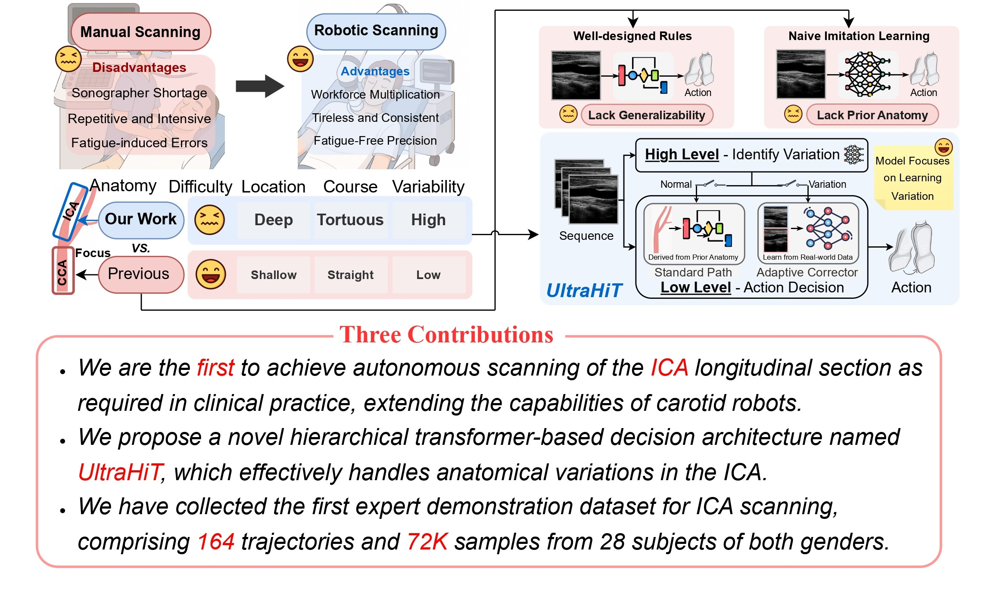
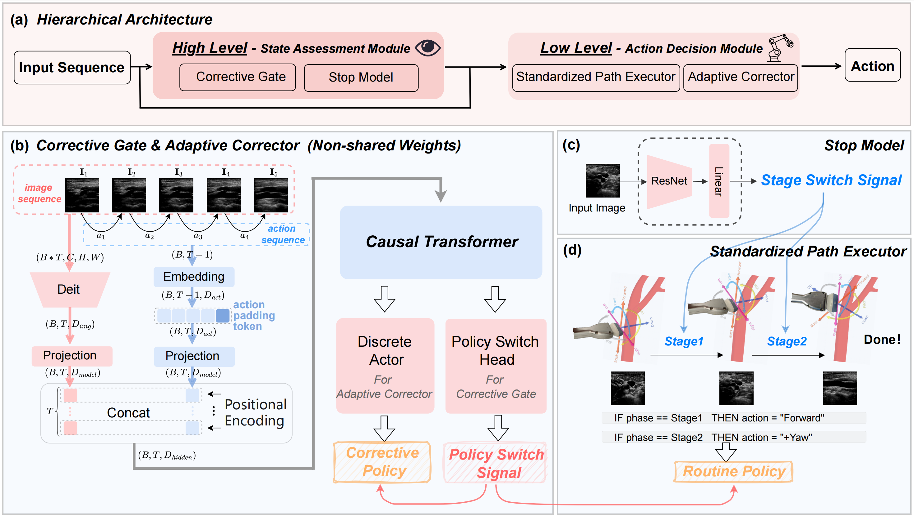

<div align="center">

# ✨ UltraHiT: A Hierarchical Transformer Architecture for Generalizable Internal Carotid Artery Robotic Ultrasonography


## Accepted By ICRA 2026!

### [📄 arXiv Paper](https://arxiv.org/abs/2509.13832) &nbsp;&nbsp;&nbsp; [🌐 Project Page](https://ultrahit-thu.github.io/UltraHiT/)

</div>

---

## 🩺 Overview

Carotid ultrasound is crucial for the assessment of cerebrovascular health, particularly the internal carotid artery (ICA). While previous research has explored automating carotid ultrasound, none has tackled the challenging ICA. This is primarily due to its deep location, tortuous course, and significant individual variations, which greatly increase scanning complexity. To address this, we propose a **Hi**erarchical **T**ransformer-based decision architecture, namely **UltraHiT**, that integrates high-level variation assessment with low-level action decision. Our motivation stems from conceptualizing individual vascular structures as morphological variations derived from a standard vascular model. The high-level module identifies variation and switches between two low-level modules: an adaptive corrector for variations, or a standard executor for normal cases. Specifically, both the high-level module and the adaptive corrector are implemented as causal transformers that generate predictions based on the historical scanning sequence. To ensure generalizability, we collected the first large-scale ICA scanning dataset comprising 164 trajectories and 72K samples from 28 subjects of both genders. Based on the above innovations, our approach achieves a **95% success rate** in locating the ICA on unseen individuals, outperforming baselines and demonstrating its effectiveness.

<p align="center">
  
</p>

---


## 🔬 Method

Hierarchical transformer architecture:

- (a) Overview of hierarchical architecture. The high-level module makes semantic decisions, while the low-level module executes physical actions in the real world. 

- (b) The corrective gate and adaptive corrector, process image-action sequences through a causal transformer. 

- (c) The stop model architecture. 

- (d) The standardized path executor, a knowledge-based policy designed using anatomical prior knowledge.

<p align="center">
  
</p>

---

## ⚙️ Environment Setup

### Requirements

The following packages are required:

```bash
torch>=1.8.0
torchvision>=0.9.0
numpy
pandas
Pillow
tqdm
easydict
tensorboard
````

### Installation

1. Clone the repository:

```bash
git clone <repository-url>
cd UltraHiT
```

2. Create and activate a conda environment (recommended):

```bash
conda create -n ultrahit python=3.8
conda activate ultrahit
```

3. Install the required packages:

```bash
pip install torch torchvision numpy pandas Pillow tqdm easydict tensorboard
```

---

## 🗂️ Data Preparation

Training and validation CSV files are specified directly in the training commands.

Please first organize your dataset into CSV files.
The expected CSV format includes the following columns:

* **`path`**: image path
* **`action_key`**: action label
* **`stage`**: scanning stage

A minimal example is shown below:

| path                  | action_key | stage |
| --------------------- | ---------- | ----- |
| `/path/to/image1.jpg` | `i`        | `2`   |
| `/path/to/image2.jpg` | `x`        | `2`   |

The `action_key` column uses the following action definitions:

| Key | Action Description   |
| --- | -------------------- |
| `u` | up                   |
| `i` | forward              |
| `o` | down                 |
| `j` | left                 |
| `k` | back                 |
| `l` | right                |
| `9` | + yaw                |
| `7` | - yaw                |
| `8` | + pitch              |
| `5` | - pitch              |
| `6` | + roll               |
| `4` | - roll               |
| `x` | stop                 |

The definition of the 3D coordinate system follows **Fig. 7** in the paper.

---

## 🚀 Training

Below are example commands for **stage 2** training.

### 1. Train Adaptive Corrector

```bash
CUDA_VISIBLE_DEVICES=0,1,2,3 torchrun --nproc-per-node=4 --master_port 29505 train_adaptive_corrector.py \
    --arch deit_tiny \
    --log-dir logs \
    --exp-name train_adaptive_corrector_stage2 \
    --batch-size 256 \
    --epochs 10 \
    --lr 0.0001 \
    --weight-decay 0.001 \
    --normalizer imagenet \
    --train-csv stage2_total_train_data.csv \
    --val-csv stage2_total_eval_data.csv \
    --seed 42 \
    --scheduler cosine \
    --seq-len 5 \
    --stage 2
```

### 2. Train Corrective Gate

```bash
CUDA_VISIBLE_DEVICES=0,1,2,3 torchrun --nproc-per-node=4 --master_port 29505 train_corrective_gate.py \
    --arch deit_tiny \
    --log-dir logs \
    --exp-name train_corrective_gate_stage2 \
    --batch-size 256 \
    --epochs 10 \
    --lr 0.0001 \
    --weight-decay 0.001 \
    --normalizer imagenet \
    --train-csv stage2_total_train_data.csv \
    --val-csv stage2_total_eval_data.csv \
    --seed 42 \
    --scheduler cosine \
    --seq-len 5 \
    --stage 2
```

### 3. Train Stop Model

```bash
CUDA_VISIBLE_DEVICES=0,1,2,3 torchrun --nproc-per-node=4 --master_port 29505 train_stop_model.py \
    --arch resnet50 \
    --log-dir logs \
    --exp-name train_stop_model_stage2 \
    --batch-size 256 \
    --epochs 10 \
    --lr 0.0001 \
    --weight-decay 0.001 \
    --normalizer imagenet \
    --train-csv stage2_stop_model_train.csv \
    --val-csv stage2_stop_model_eval.csv \
    --seed 42 \
    --scheduler cosine \
    --stage 2
```

The commands above use **stage 2** as an example.
To train **stage 1**, please replace the CSV files and set `--stage 1`.

---

## 📌 Notes

* Logs and checkpoints will be saved under the directory specified by `--log-dir`.
* Multi-GPU training is supported via `torchrun`.
* Please make sure all paths in the CSV files are valid before training.

---

## 📖 Reference

If you find our project useful in your research, please consider citing:

```bibtex
@article{wang2025ultrahit,
  title   = {UltraHiT: A Hierarchical Transformer Architecture for Generalizable Internal Carotid Artery Robotic Ultrasonography},
  author  = {Teng Wang and Haojun Jiang and Yuxuan Wang and Zhenguo Sun and Xiangjie Yan and Xiang Li and Gao Huang},
  journal = {arXiv preprint arXiv:2509.13832},
  year    = {2025}
}
```

